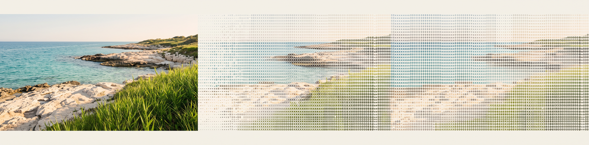

<p align="center">
  
</p>

<h1 align="center">Kakashi ✧ カカシ</h1>

<p align="center">
  Claude Code skills that clone any website into a production-ready<br/>
  Next.js + Tailwind + TypeScript codebase.
</p>

<p align="center">
  
  
  
  
</p>

---

## What it does

You give Claude Code a URL. You get back a real Next.js project: typed components, a Tailwind theme extracted from the source, downloaded fonts and images, and working animations. Not a screenshot, not a static HTML dump. A codebase you can run `npm run dev` on.

Two skills do this, using opposite strategies. Pick by how you want the **motion** reproduced.

---

## `kakashi` ✧ rebuild it

<p align="center">
  
</p>

The page is taken apart. Colors, type scale, spacing, and shadows are extracted into a token file. The DOM is read as structure, not markup, and rewritten as idiomatic React components. Animations are found in the original bundles, then **rewritten in GSAP** so you own them.

Six phases, five hard gates, seventeen verification scripts that grade the clone against the captured original. The agent never self-grades.

**Use it when** you need to own and change the animations, or the original JavaScript cannot run outside its backend.

```
"Clone https://example.com into a Next.js project"
```

---

## `kakashi-fast` ✧ adopt its engine

<p align="center">
  
</p>

The DOM is reproduced byte for byte, then the **original site's own CSS and JS are vendored and run against it**. The motion is not reimplemented, it *is* the original code, so easing curves, scroll timelines, and stagger offsets land exactly where they landed on the source.

Fewer phases, less guesswork, and the highest fidelity available. "Fast" here means fewer steps to an exact result, not a cheaper approximation.

**Use it when** the original JS is reusable and you want a pixel-and-motion-perfect replica. This is the default worth trying first.

```
"Copy the web page https://example.com, keep its engine"
```

---

## Which one

| | [`kakashi`](skills/kakashi) | [`kakashi-fast`](skills/kakashi-fast) |
|---|---|---|
| **Strategy** | Reimplementation. Extract the design system, rebuild components, rewrite animations | Engine adoption. Reproduce the DOM, then run the original site's own CSS and JS on it |
| **You own the code** | Yes, idiomatic React you can modify | Partly. The vendored engine is a black box you must not edit |
| **Motion fidelity** | Very close, but reimplemented motion can drift | Exact. It *is* the original code |
| **Process** | 6 enforced phases, 17 verification scripts | 6 phases, verified against live engine state |
| **Speed** | Slower, every component is authored | Faster, the engine does the work |
| **Pick when** | You must own and change the animations, or the JS cannot run standalone | The JS is reusable and you want an exact replica |

Start with `kakashi-fast`. Fall back to `kakashi` when the JS is inseparable from a live backend, is an obfuscated anti-bot bundle, or when you explicitly want the motion rebuilt in React so you can own it.

### `animation-forge`

A companion, not a cloner. Once you have a page, it adds scroll effects, 3D, hover states, and text reveals from a menu. You pick, it wires GSAP and Three.js in. Referenced by the `kakashi` workflow.

---

## Install

```bash
git clone https://github.com/ELATTAR-Ayoub/kakashi.git
cd kakashi

cp -r skills/kakashi          ~/.claude/skills/kakashi
cp -r skills/kakashi-fast     ~/.claude/skills/kakashi-fast
cp -r skills/animation-forge  ~/.claude/skills/animation-forge
```

**Prerequisites:** [Claude Code](https://docs.anthropic.com/en/docs/claude-code), Node.js 18+, Python 3 (asset download scripts).

`kakashi` also expects the Superpowers plugins:

```
/plugin marketplace add obra/superpowers-marketplace
/plugin install superpowers@superpowers-marketplace
/plugin install frontend-design@claude-plugins-official
```

Skills trigger automatically from what you ask. No slash commands needed.

---

## Repo layout

```
skills/
  kakashi/              Reimplementation cloner
    SKILL.md              6 phases + enforcement gates
    README.md             Full tutorial and workflow
    references/           Animation extraction, component patterns, starter templates
    scripts/              Capture: fetch-page.sh, download-assets.py, detect-stack.py,
                          extract-design-system.py, search-animations.sh
    scripts/verify/       17 verification scripts, the clone grades itself
    evals/                Eval cases
  kakashi-fast/         Engine-adoption cloner
    SKILL.md              Capture, vendor, run
    references/           capture.md, engine-adoption.md, verify.md
    scripts/              fetch.sh, fetch-modules.sh
  animation-forge/      Animation companion
docs/images/            README artwork
```

---

## Why `kakashi` is phase-gated

The skill was hardened after a repeated failure mode: the agent acknowledges the skill, then skips straight to writing components and invents values it never extracted. So the skill enforces itself:

- **5 hard gates:** no code before the page is captured, before `PROGRESS.md` exists, before the design system is extracted. No "done" before the disclosure report.
- **Fetch escalation ladder:** 5 mandatory steps before it may claim a page cannot be fetched. "It's a CSR site" is not an excuse.
- **Anti-rationalization list:** the specific excuses the agent has used before, each with why it is invalid.
- **Blocker protocol:** when stuck it stops and presents options, instead of silently approximating.
- **Phase files:** instructions are re-read from disk before every phase, so context compaction cannot erase the extraction work.
- **Scripts are the judge:** the agent never self-grades.

---

## Disclosure and IP

These skills replicate an existing website. **The content, images, logos, fonts, and brand of the source site belong to its owner.** A clone is a starting structure, not something publishable as-is. Replace the assets and copy before shipping anything public. Both cloners end with a mandatory disclosure phase reporting what was copied 1:1, what was approximated, and what was skipped.

Use them on sites you own, on references you have the right to adapt, or as scaffolding you then make your own.
