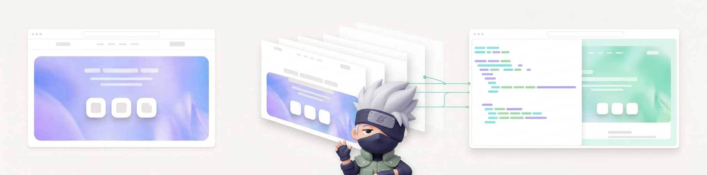
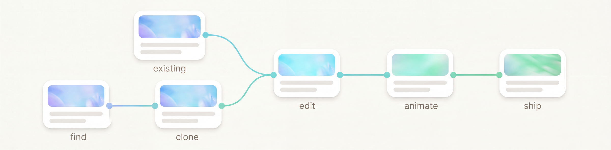
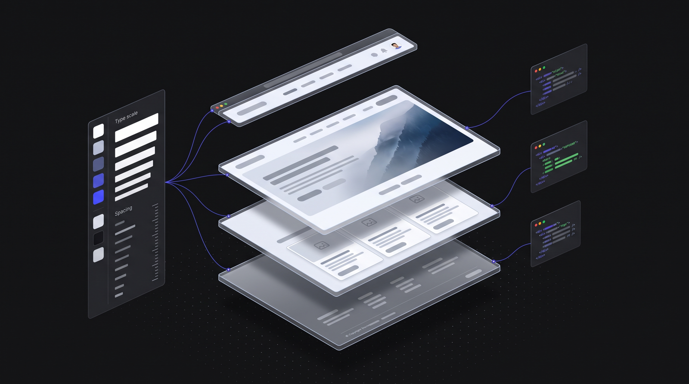
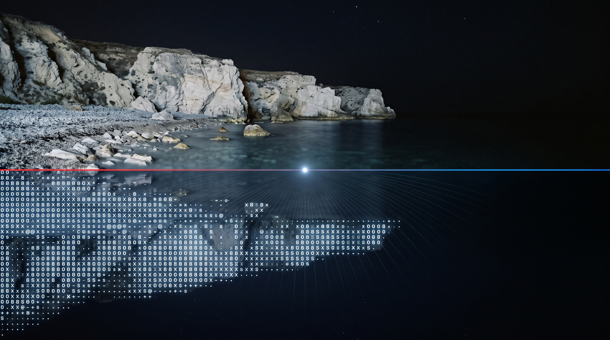
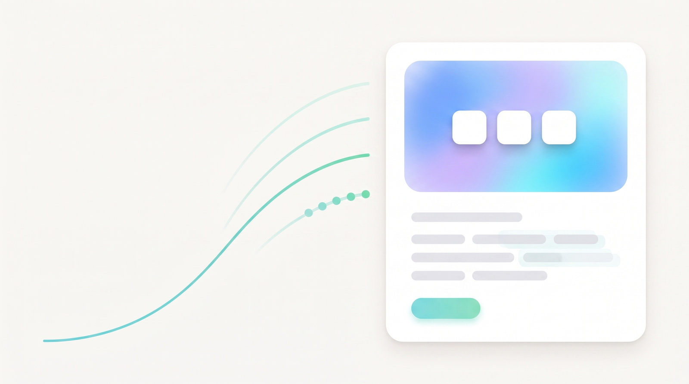

<p align="center">
  
</p>

<h1 align="center">Kakashi ✧ カカシ</h1>

<p align="center">
  Claude Code skills that turn a website you like into a production-ready<br/>
  Next.js + Tailwind + TypeScript codebase, then animate it.
</p>

<p align="center">
  
  
  
  
</p>

---

## Who this is for

You are a backend developer. You can ship an API in an afternoon. Then someone asks for a landing page and you lose a week producing something that works but looks like a bootstrap template from 2016.

The problem is not that you cannot code. It is that good landing pages are made of things nobody teaches you on the backend: a real type scale, spacing that is consistent to the pixel, scroll timelines, easing curves, stagger offsets, a hero that resolves instead of just appearing.

So do what designers actually do. Find a site whose design already works, take it apart, learn its system, and build your thing on top of it.

That is what these skills do:

1. You find a landing page you like.
2. Claude clones it into a real Next.js project you own.
3. You replace the words and images with yours.
4. You ask for animation in plain English and get GSAP that a frontend engineer would sign off on.

You never write a keyframe. You never pick a cubic-bezier. The output is not generic AI slop, because none of it was invented: the layout, spacing, colour and motion are all measured off a page that already looked good.

---

## The workflow

<p align="center">
  
</p>

There are two ways in. Either you clone a page you like, or you already have a landing page and only want the motion. Both meet at the same place.

| Step | What you do | What you type |
|---|---|---|
| **find** | Browse for a landing page you like. Same industry as yours gives better results. | nothing |
| **clone** | Claude captures it and rebuilds it as a Next.js project. | `Clone https://the-site.com` |
| **existing** | Or skip the two steps above and point Claude at a project you already have. | `Open my project at ./site` |
| **edit** | Swap in your product name, your copy, your images. | `Change the hero copy to ...` |
| **animate** | Add motion without knowing GSAP. | `Add scroll animations to the hero` |
| **ship** | `npm run build`, deploy anywhere Next.js runs. | `npm run build` |

Cloning and animating are where the skills do the work. They are covered below.

---

## Pick a cloner

Two skills clone. They produce the same kind of output, a Next.js + Tailwind + TypeScript project. They differ in **how they reproduce the motion**, and that is the whole decision.

### `kakashi` ✧ rebuilds it

<p align="center">
  
</p>

The page gets taken apart. Every colour, every font size, every spacing value and shadow is measured off the original and written into a token file. The DOM is read as structure rather than markup and rewritten as React components. Animations are found in the original bundles and rewritten in GSAP.

The result is code you own. You can change the accent colour in one place, delete a section, restyle a card, and everything still holds together, because you have the design system, not just the page.

**Use this when** you plan to build on top of the clone rather than just host it, or when the original JavaScript cannot run outside its backend.

```
Clone https://the-site.com into a Next.js project
```

### `kakashi-fast` ✧ just clones it

<p align="center">
  
</p>

No rebuilding. The DOM is reproduced byte for byte, then the original site's own CSS and JavaScript are vendored and run against it. The motion is not reimplemented, it *is* the original code, so easing curves, scroll timelines and stagger offsets land exactly where they landed on the source.

Fewer steps, less guesswork, highest fidelity available. "Fast" means fewer steps to an exact result, not a cheaper approximation.

**Use this when** you want the replica to be indistinguishable and you are not planning to restructure it. The vendored engine is a black box you must not edit.

```
Copy https://the-site.com and keep its engine
```

### Which one

| | `kakashi` | `kakashi-fast` |
|---|---|---|
| **Strategy** | Extract the design system, rebuild as components | Reproduce the DOM, run the original's own engine on it |
| **You own the code** | Yes, idiomatic React you can change freely | Partly, the engine is vendored and off limits |
| **Motion fidelity** | Very close, but reimplemented motion can drift | Exact, it is the original code |
| **Speed** | Slower, every component is authored | Faster, the engine does the work |
| **Then what** | Build your product on it | Host it, swap the content |
| **Verification** | 6 enforced phases, 17 scripts grade the clone | 6 phases, verified against live engine state |

Not sure? Use `kakashi`. Owning the code matters more than the last five percent of motion fidelity, and animating gives you the motion back anyway.

---

## Animate it

<p align="center">
  
</p>

`animation-forge` is a companion, not a cloner. Point it at any page, cloned or one you already had, and ask for motion in plain English. It presents a menu of effects, you pick, it writes and wires in the GSAP or Three.js.

What it can add:

- **Scroll**: pinned sections, parallax, reveal on enter, scroll-linked progress
- **Text**: character and word stagger, split reveals, typewriter, scramble
- **3D**: Three.js scenes, floating objects, cursor-reactive geometry
- **Micro-interactions**: hover lifts, magnetic buttons, cursor followers, page transitions

```
Add a scroll reveal to the feature cards and a text stagger to the hero
```

You do not need to know what an easing curve is. You need to know what you want it to feel like.

---

## Install

```bash
git clone https://github.com/ELATTAR-Ayoub/kakashi.git
cd kakashi

cp -r skills/kakashi          ~/.claude/skills/kakashi
cp -r skills/kakashi-fast     ~/.claude/skills/kakashi-fast
cp -r skills/animation-forge  ~/.claude/skills/animation-forge
```

**Prerequisites:** [Claude Code](https://docs.anthropic.com/en/docs/claude-code), Node.js 18+, Python 3 (the asset download scripts).

`kakashi` also expects the Superpowers plugins:

```
/plugin marketplace add obra/superpowers-marketplace
/plugin install superpowers@superpowers-marketplace
/plugin install frontend-design@claude-plugins-official
```

Skills trigger automatically from what you ask. There are no slash commands to memorise.

---

## A full session, start to finish

```
You:    Clone https://linear.app into a Next.js project

Claude: [captures the page, downloads fonts and images, extracts the
         design system, rebuilds the components, verifies each phase,
         then reports what it copied and what it approximated]

You:    Replace the copy with my product. It is called Ledger, an
        invoicing API for freelancers.

You:    Swap the hero image for public/assets/my-dashboard.png

You:    Add a scroll reveal to the pricing cards, and make the hero
        headline animate in word by word

You:    npm run build
```

Four messages. The design quality came from the reference, the motion came from `animation-forge`, and the code is yours.

---

## What you get, and what you do not

**You get:** a real Next.js App Router project, typed components, a Tailwind theme built from extracted tokens, downloaded fonts and images, working animations, and a build that passes.

**You do not get:** the source site's content. Every clone ends with a mandatory disclosure report listing what was copied 1:1, what was approximated, and what was skipped, so you know exactly what still needs replacing before you ship.

---

## Repo layout

```
skills/
  kakashi/              Rebuilds it: design system to components
    SKILL.md              6 phases + enforcement gates
    README.md             Full tutorial and workflow
    references/           Animation extraction, component patterns, starter templates
    scripts/              Capture: fetch-page.sh, download-assets.py, detect-stack.py,
                          extract-design-system.py, search-animations.sh
    scripts/verify/       17 verification scripts, the clone gets graded
    evals/                Eval cases
  kakashi-fast/         Just clones it: DOM plus the original engine
    SKILL.md              Capture, vendor, run
    references/           capture.md, engine-adoption.md, verify.md
    scripts/              fetch.sh, fetch-modules.sh
  animation-forge/      Adds motion to any page
docs/images/            README artwork
```

---

## Why `kakashi` is phase-gated

The skill was hardened after a repeated failure mode: the agent acknowledges the skill, then skips straight to writing components and invents values it never extracted. Invented values are exactly how you end up with generic output. So the skill enforces itself:

- **5 hard gates:** no code before the page is captured, before `PROGRESS.md` exists, before the design system is extracted. No "done" before the disclosure report.
- **Fetch escalation ladder:** 5 mandatory steps before it may claim a page cannot be fetched. "It's a CSR site" is not an excuse.
- **Anti-rationalization list:** the specific excuses the agent has used before, each with why it is invalid.
- **Blocker protocol:** when stuck it stops and presents options, instead of silently approximating.
- **Phase files:** instructions are re-read from disk before every phase, so context compaction cannot erase the extraction work.
- **Scripts are the judge:** the agent never grades its own work.

This is the difference between a clone and a guess.

---

## Disclosure and IP

These skills replicate an existing website. **The content, images, logos, fonts and brand of the source site belong to its owner.** A clone is a starting structure, not something publishable as-is. Replace the assets and the copy before shipping anything public.

Use them on sites you own, on references you have the right to adapt, or as scaffolding you then make your own.
